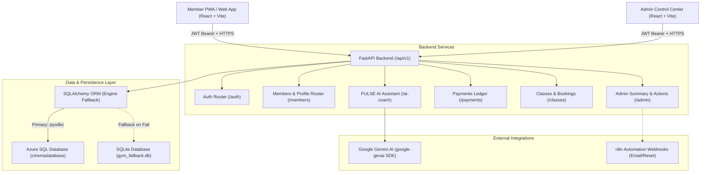

# KINETIC Gym — Master Project Architecture & Blueprint

This document serves as the **Single Source of Truth** for the entire KINETIC Gym Management System, covering backend, frontend, database schemas, authentication workflows, integrations, and deployment configurations.

---

## 1. System Architecture Overview



---

## 2. Directory Structure & File Map

```text
/project
├── fastapi-backend/                 # Python 3.11+ FastAPI Backend
│   ├── app/
│   │   ├── core/                   # Core Settings & Infrastructure
│   │   │   ├── config.py           # Pydantic Settings, CORS, Env Variables
│   │   │   ├── database.py         # Azure SQL Engine + SQLite Fallback Engine
│   │   │   ├── dependencies.py     # Auth dependencies: get_current_user, require_admin, require_full_access
│   │   │   ├── init_db.py          # Auto-migrations for schema parity & default seed data
│   │   │   └── security.py         # Native bcrypt & werkzeug JWT and hashing engine
│   │   ├── models/                 # SQLAlchemy Database Models
│   │   │   ├── user.py             # Users table (members, admins, profiles, PINs)
│   │   │   ├── membership_plan.py  # Starter, Pro, Elite VIP plans
│   │   │   ├── membership.py       # Active member subscriptions & validity dates
│   │   │   ├── payment.py          # Payment ledger & proof receipts
│   │   │   ├── gym_class.py        # Scheduled workout classes & time slots
│   │   │   ├── class_booking.py    # Class reservations per member
│   │   │   ├── trainer.py          # Personal fitness instructors
│   │   │   ├── equipment_asset.py  # Gym machines & 90-day servicing status
│   │   │   ├── attendance.py       # Member gym check-in log
│   │   │   └── weight_log.py       # Daily bodyweight progress logs
│   │   ├── routers/                # FastAPI Endpoints
│   │   │   ├── auth.py             # /auth: Token, Signup, Password Reset
│   │   │   ├── members.py          # /members: Profile /me, Onboarding, Change Password
│   │   │   ├── admin.py            # /admin: Dashboard summary, Reset PIN, Approvals
│   │   │   ├── memberships.py      # /membership-plans & /memberships/subscribe
│   │   │   ├── payments.py         # /payments: Submit proof, Cash payments, Approvals
│   │   │   ├── classes.py          # /classes: Schedule, Book, Cancel
│   │   │   ├── trainers.py         # /trainers: Staff instructors registry
│   │   │   ├── assets.py           # /assets: Gym equipment & maintenance
│   │   │   ├── attendance.py       # /attendance: Check-in records
│   │   │   ├── weight.py           # /weight: Weight logs & body metrics
│   │   │   └── ai_coach.py         # /ai-coach: PULSE AI Assistant chat with tool calls
│   │   ├── schemas/                # Pydantic v2 Request & Response Schemas
│   │   ├── services/               # Business Logic Layer (Clean Architecture)
│   │   └── main.py                 # FastAPI Application instance, CORS, static routes
│   ├── Dockerfile                  # Production container for Linux / Railway
│   ├── Procfile                    # Web process runner
│   └── requirements.txt            # Pinned backend dependencies
│
├── react-frontend/                  # React 18 + Vite + Tailwind CSS Frontend
│   ├── src/
│   │   ├── api/
│   │   │   └── client.ts           # Axios HTTP client with Bearer interceptors & auto-logout
│   │   ├── context/
│   │   │   ├── AuthContext.tsx     # Global auth state, tokens, user profile, refreshProfile
│   │   │   └── ToastContext.tsx    # Toast notifications
│   │   ├── types/
│   │   │   └── index.ts            # TypeScript interfaces matching backend models
│   │   ├── pages/
│   │   │   ├── MemberAppPage.tsx   # Mobile-first PWA Member experience
│   │   │   ├── AdminLoginPage.tsx  # Staff admin login screen
│   │   │   └── AdminDashboardPage.tsx # Administration control center with tab views
│   │   ├── components/
│   │   │   ├── admin/              # Admin tabs (Overview, Members, Trainers, Schedule, Revenue, Assets, MemberDetailModal)
│   │   │   ├── member/             # Member screens (Home, Classes, Weight, Billing, Profile, AICoachDrawer, Modals)
│   │   │   └── common/             # Modals, LoadingSpinner, ProtectedRoute
│   │   ├── App.tsx                 # Route declarations (HashRouter)
│   │   └── main.tsx                # React entry point
│   ├── package.json                # Frontend dependencies
│   └── vite.config.ts              # Vite dev server & proxy settings
│
├── uploads/payment_proofs/          # Local uploaded proof receipts directory
├── gym_fallback.db                 # Local SQLite fallback database with synced schema
├── Dockerfile                      # Root deployment Dockerfile
└── vercel.json                     # Vercel SPA rewrite config
```

---

## 3. Core Technical Standards

### Authentication & Password Management
1. **Password Engine**: Native `bcrypt` for hashing + `werkzeug.security` fallback for legacy hashes (`scrypt:` and `pbkdf2:`).
2. **Deterministic Tokens**: JWT token containing `sub: user_id`, `role`, and `exp` (7 days expiry).
3. **PIN Synchronization**: All numeric PINs are stored in `User.plain_password` AND hashed into `User.password`. Admins can reset member PINs at any time via `POST /api/v1/admin/members/{user_id}/reset-password`.

### Dual-Database Resilience
* **Primary**: Azure SQL Server (`cinemadatabase.database.windows.net`).
* **Fallback**: SQLite (`gym_fallback.db`).
* `init_db.py` runs on every startup to ensure schema parity (missing columns are automatically added via `ALTER TABLE`) and seeds required admin and member accounts.

### Roles & Access Matrix
* **Role `admin`**: Full access to Admin Dashboard, financial approvals, member management, equipment registry, class schedules.
* **Role `member`**: Access to Member App. If unapproved or inactive, access is gracefully restricted to the Billing/Plan selection tab.
