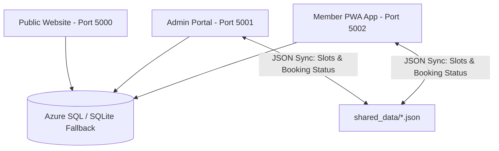
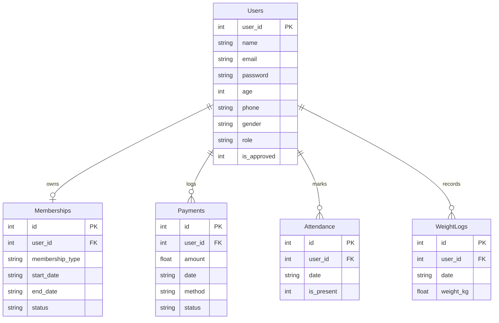
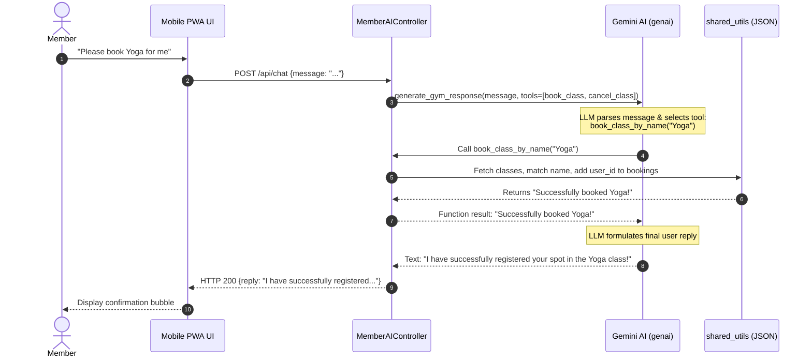

# KINETIC Gym Master Specifications

This document outlines the Product Requirements, Technical Requirements, and System Design for the **KINETIC Gym Suite**, a premium, decoupled gym management platform consisting of the public landing page, the staff admin portal, and the mobile member PWA portal.

---

# 1. Product Requirement Document (PRD)

## 1.1 Purpose & Vision
The KINETIC Gym platform delivers an upscale digital experience to gym members and administrators. The core vision is to combine premium visual aesthetics with cross-platform convenience (PWA) and next-generation AI coaching (Gemini function calling) to elevate fitness tracking, attendance, billing, and booking.

## 1.2 User Personas & Target Audience
* **Guest User / Prospect**: Views the landing page to browse pricing tiers, gym trainers, and class schedules.
* **Gym Member**: Interacts primarily via the Mobile PWA to log weight history, book workout classes, complete gate check-ins (attendance), make subscription payments, and converse with the PULSE AI coach.
* **Gym Staff / Administrator**: Logs into the desktop Admin Portal to manage memberships, process pending billing invoices, add new trainers, edit class rosters, and review gate attendance logs.

## 1.3 Key Feature List

### A. Public Landing Page (`website/`)
* **Responsive Presentation**: Dynamic hero section with premium dark-obsidian and gold branding.
* **Package Cards**: Interconnected display of Starter, Pro, and Elite subscription tiers.
* **Class Schedules & Trainer Showcases**: Prominently displays available gym offerings.

### B. Admin Management Portal (`admin-portal/`)
* **Admin Dashboard**: Central analytics showing total members, monthly revenue, active subscriptions, and check-in ratios.
* **Trainer Roster Management**: Interface to add, modify, and delete trainers.
* **Membership Status Controls**: Allows manual activation/suspension of user memberships.
* **Billing Auditing Ledger**: Invoice manager displaying member transactions with status approval capabilities (e.g., approving pending payments to activate memberships).
* **Attendance Auditing**: Real-time listing of daily gym check-ins.

### C. Member Mobile PWA Portal (`member-app/`)
* **PWA Mobile-First Interface**: Fullscreen standalone mode with unified navigation tabs (Home, Classes, Billing, AI Coach, Profile).
* **PWA Compliance**: Add-to-homescreen triggers, customized manifest, and dynamic caching service worker.
* **Gate Check-In**: Self-service gate check-in button logging daily attendance.
* **Integrated Booking System**: Synchronized class schedules roster booking/cancellation.
* **Weight Tracker**: Chronological log of weight history.
* **AI Coach (PULSE AI)**: Gemini-powered context-aware assistant capable of providing customized fitness advice and taking action to book/cancel classes.

---

# 2. Technical Requirement Document (TRD)

## 2.1 Tech Stack
* **Language & Framework**: Python (Flask) for backend services and API routes.
* **Frontend**: HTML5, Vanilla JavaScript, Vanilla CSS (harmonious HSL variables, dark mode glassmorphism).
* **Database Engine**: Multi-dialect SQL layout supporting:
  * **Primary**: Cloud Azure SQL Database via `pyodbc` (using Microsoft ODBC Driver 17).
  * **Secondary / Local Fallback**: Dynamic SQLite (`gym_fallback.db`) with automatic structural auto-seeding.
* **LLM Engine**: `google-genai` package connecting to model `gemini-3.1-flash-lite`.

## 2.2 System Architecture (Decoupled Microservices)
The project is split into three independent web apps running on unique ports. They connect to the same central database, and share session data and class rosters dynamically.



### Process Coordination Matrix
| Service | Port | Directory Scope | Primary Responsibility |
| :--- | :--- | :--- | :--- |
| **Website** | 5000 | `/website` | Marketing front-end, public registration endpoints |
| **Admin Portal** | 5001 | `/admin-portal` | Core administration MVC, membership, trainers, billing approvals |
| **Member App** | 5002 | `/member-app` | Standalone PWA, mobile views, controllers, PWA assets, Gemini AI engine |

## 2.3 Shared Slot Sync System (`shared_utils.py`)
To prevent concurrent scheduling collisions between the Admin Portal process and the Member App PWA process, the booking records are synced via thread-safe file operations in a shared directory:
* **Classes JSON**: `shared_data/classes.json`
* **Bookings JSON**: `shared_data/bookings.json`
`shared_utils.py` uses context locks to safely read and write to these files across python processes.

## 2.4 PWA Technical Specifications
* **Manifest Route**: Served from root `/manifest.json` with the required `application/manifest+json` MIME-type header.
* **Service Worker**: Served from `/sw.js` with `application/javascript` headers. It utilizes an empty static pre-cache list combined with on-the-fly fetch interception caching. This guarantees the service worker registers successfully on the phone even during network latency.
* **Global CORS Hook**: Both `/manifest.json` and PWA images return `Access-Control-Allow-Origin: *` to satisfy cross-origin crawling and testing tools.

---

# 3. System Design Document

## 3.1 MVC Directory Layout (Member App Focus)
To maintain structural separation, all business logic has been refactored into stateless controllers inside `member-app/Controllers/`:

```
member-app/
├── Controllers/
│   ├── MemberAIController.py        # Dedicated chatbot controller & tools
│   ├── MemberAuthController.py      # Registration & authentication
│   ├── MemberClassController.py     # Class schedules & sync bookings
│   ├── MemberProfileController.py   # Profile details & update forms
│   ├── MemberWeightController.py    # Log history entries
│   ├── MemberBillingController.py   # Memberships & invoice ledger
│   └── MemberAttendanceController.py # Check-ins & calendars
├── Database/
│   └── DBConnection.py              # Cloud & fallback SQLite resolver
├── Models/
│   └── User.py                      # User model
├── Repository/
│   └── UserRepo.py                  # User table queries
├── Services/
│   └── AIService.py                 # Gemini Client connector
├── templates/
│   └── member_app.html              # Frontend template containing tabs
└── app.py                           # Clean route mapper
```

## 3.2 Database Schema Entity Relationship



## 3.3 Agentic Tool-Use Integration Flow
The PULSE AI Coach agent uses Google Gemini's **integrated function calling**. Below is the sequence when a member asks the agent to register a booking:


